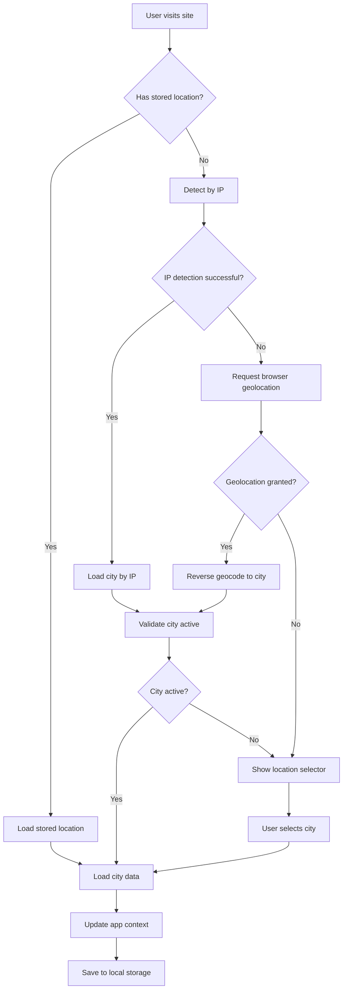
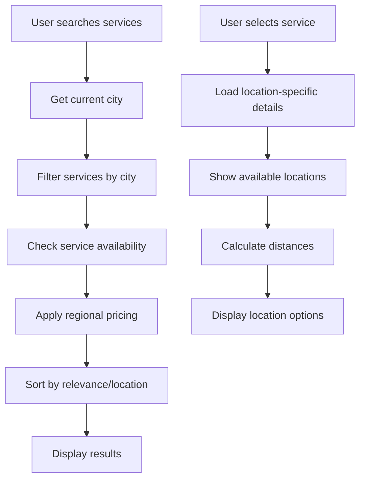

# Multi-City Architecture Design

## Overview

This document outlines the comprehensive architecture for implementing multi-city support in the beauty and fitness booking platform. The design enables expansion from Warsaw to multiple Polish cities with full localization, regional pricing, and compliance management.

## Architecture Components

### 1. Database Schema Enhancements

#### Enhanced Locations Table
```sql
-- Update existing locations table
ALTER TABLE locations
ADD COLUMN country_code VARCHAR(3) DEFAULT 'PL',
ADD COLUMN region VARCHAR(100),
ADD COLUMN city VARCHAR(100) NOT NULL,
ADD COLUMN district VARCHAR(100),
ADD COLUMN postal_code VARCHAR(20),
ADD COLUMN latitude DECIMAL(10, 8),
ADD COLUMN longitude DECIMAL(11, 8),
ADD COLUMN timezone VARCHAR(50) DEFAULT 'Europe/Warsaw',
ADD COLUMN phone VARCHAR(20),
ADD COLUMN email VARCHAR(255),
ADD COLUMN website VARCHAR(255),
ADD COLUMN operating_hours JSONB,
ADD COLUMN services_offered TEXT[],
ADD COLUMN is_primary_location BOOLEAN DEFAULT FALSE,
ADD COLUMN location_metadata JSONB,
ADD COLUMN seo_slug VARCHAR(100),
ADD COLUMN is_active BOOLEAN DEFAULT TRUE,
ADD COLUMN launched_at TIMESTAMP;

-- Add indexes for performance
CREATE INDEX idx_locations_city_active ON locations(city, is_active);
CREATE INDEX idx_locations_country_active ON locations(country_code, is_active);
CREATE INDEX idx_locations_coordinates ON locations(latitude, longitude);
```

#### Cities Configuration Table
```sql
CREATE TABLE cities (
  id UUID PRIMARY KEY DEFAULT gen_random_uuid(),
  name VARCHAR(100) NOT NULL,
  country_code VARCHAR(3) NOT NULL,
  region VARCHAR(100),
  seo_slug VARCHAR(100) UNIQUE NOT NULL,
  default_currency VARCHAR(3) NOT NULL DEFAULT 'PLN',
  timezone VARCHAR(50) NOT NULL,
  latitude DECIMAL(10, 8),
  longitude DECIMAL(11, 8),
  population INTEGER,
  is_active BOOLEAN DEFAULT FALSE,
  launch_date DATE,
  marketing_config JSONB,
  legal_config JSONB,
  tax_config JSONB,
  created_at TIMESTAMP DEFAULT NOW(),
  updated_at TIMESTAMP DEFAULT NOW()
);

CREATE INDEX idx_cities_country_active ON cities(country_code, is_active);
CREATE INDEX idx_cities_slug ON cities(seo_slug);
```

#### Regional Pricing Table
```sql
CREATE TABLE regional_pricing (
  id UUID PRIMARY KEY DEFAULT gen_random_uuid(),
  service_id UUID REFERENCES services(id) ON DELETE CASCADE,
  city_id UUID REFERENCES cities(id) ON DELETE CASCADE,
  location_id UUID REFERENCES locations(id) ON DELETE CASCADE,
  base_price DECIMAL(10, 2) NOT NULL,
  currency VARCHAR(3) NOT NULL,
  tax_rate DECIMAL(5, 2) NOT NULL DEFAULT 0.23,
  valid_from DATE DEFAULT CURRENT_DATE,
  valid_until DATE,
  price_adjustments JSONB, -- For dynamic pricing rules
  is_active BOOLEAN DEFAULT TRUE,
  created_at TIMESTAMP DEFAULT NOW(),
  updated_at TIMESTAMP DEFAULT NOW(),
  UNIQUE(service_id, city_id, location_id, valid_from)
);

CREATE INDEX idx_regional_pricing_service_city ON regional_pricing(service_id, city_id);
CREATE INDEX idx_regional_pricing_active ON regional_pricing(is_active, valid_from, valid_until);
```

#### Service Location Availability
```sql
CREATE TABLE service_location_availability (
  id UUID PRIMARY KEY DEFAULT gen_random_uuid(),
  service_id UUID REFERENCES services(id) ON DELETE CASCADE,
  city_id UUID REFERENCES cities(id) ON DELETE CASCADE,
  location_id UUID REFERENCES locations(id) ON DELETE CASCADE,
  is_available BOOLEAN DEFAULT TRUE,
  max_daily_bookings INTEGER,
  booking_lead_time_days INTEGER DEFAULT 7,
  service_duration_minutes INTEGER,
  buffer_time_minutes INTEGER DEFAULT 30,
  availability_rules JSONB, -- Complex availability patterns
  seasonal_availability JSONB,
  created_at TIMESTAMP DEFAULT NOW(),
  updated_at TIMESTAMP DEFAULT NOW(),
  UNIQUE(service_id, city_id, location_id)
);
```

#### Tax and Compliance Configuration
```sql
CREATE TABLE city_tax_config (
  id UUID PRIMARY KEY DEFAULT gen_random_uuid(),
  city_id UUID REFERENCES cities(id) ON DELETE CASCADE,
  tax_type VARCHAR(50) NOT NULL, -- 'vat', 'service_tax', 'tourism_tax'
  tax_rate DECIMAL(5, 2) NOT NULL,
  tax_code VARCHAR(20),
  is_compound BOOLEAN DEFAULT FALSE,
  applicable_service_types TEXT[],
  exemption_rules JSONB,
  reporting_requirements JSONB,
  effective_date DATE DEFAULT CURRENT_DATE,
  expires_date DATE,
  is_active BOOLEAN DEFAULT TRUE,
  created_at TIMESTAMP DEFAULT NOW()
);

CREATE TABLE legal_requirements (
  id UUID PRIMARY KEY DEFAULT gen_random_uuid(),
  city_id UUID REFERENCES cities(id) ON DELETE CASCADE,
  country_code VARCHAR(3) NOT NULL,
  requirement_type VARCHAR(50) NOT NULL, -- 'data_privacy', 'consumer_rights', 'health_safety'
  document_url VARCHAR(500),
  consent_required BOOLEAN DEFAULT FALSE,
  age_restriction INTEGER,
  mandatory_disclaimers TEXT[],
  integration_config JSONB, -- For external compliance services
  is_active BOOLEAN DEFAULT TRUE,
  created_at TIMESTAMP DEFAULT NOW()
);
```

### 2. Application Architecture

#### Location Context System
```typescript
// src/contexts/LocationContext.tsx
interface LocationContextType {
  // Current location state
  currentCity: City | null;
  currentLocation: Location | null;
  availableCities: City[];
  availableLocations: Location[];

  // User location detection
  userLocation: UserLocation | null;
  isDetectingLocation: boolean;

  // Actions
  setCity: (cityId: string) => Promise<void>;
  setLocation: (locationId: string) => Promise<void>;
  detectUserLocation: () => Promise<void>;
  searchNearbyLocations: (coordinates: Coordinates) => Promise<Location[]>;

  // Utilities
  isCityActive: (cityId: string) => boolean;
  isLocationActive: (locationId: string) => boolean;
  getCityTimezone: (cityId: string) => string;
  calculateDistance: (from: Coordinates, to: Coordinates) => number;
}

interface City {
  id: string;
  name: string;
  country: string;
  region: string;
  slug: string;
  currency: string;
  timezone: string;
  coordinates: Coordinates;
  isActive: boolean;
  launchDate: string;
  marketingConfig: CityMarketingConfig;
  legalConfig: CityLegalConfig;
}

interface Location {
  id: string;
  name: string;
  type: LocationType;
  cityId: string;
  city: string;
  address: string;
  coordinates: Coordinates;
  timezone: string;
  phone: string;
  email: string;
  operatingHours: OperatingHours;
  servicesOffered: string[];
  metadata: LocationMetadata;
}

interface UserLocation {
  ip: string;
  country: string;
  region: string;
  city: string;
  timezone: string;
  coordinates?: Coordinates;
  detectedBy: 'ip' | 'geolocation' | 'manual';
  confidence: number; // 0-1
}
```

#### Location Service Architecture
```typescript
// src/services/LocationService.ts
export class LocationService {
  // Geolocation detection
  static async detectUserLocation(): Promise<UserLocation>
  static async reverseGeocode(lat: number, lng: number): Promise<Address>
  static async geocodeAddress(address: string): Promise<Coordinates>

  // City management
  static async getActiveCities(): Promise<City[]>
  static async getCityBySlug(slug: string): Promise<City>
  static async getLocationsInCity(cityId: string): Promise<Location[]>

  // Search and discovery
  static async searchNearbyServices(params: SearchParams): Promise<Service[]>
  static async getLocationsForService(serviceId: string): Promise<Location[]>

  // Distance and availability
  static async calculateDistance(from: Coordinates, to: Coordinates): Promise<number>
  static async getTravelTime(from: Coordinates, to: Coordinates): Promise<TravelTime>
  static async checkServiceAvailability(serviceId: string, locationId: string): Promise<boolean>
}
```

### 3. State Management Architecture

#### Location-Aware Booking Store
```typescript
// src/stores/bookingStore.ts (enhanced)
interface BookingStore {
  // Location-specific booking data
  selectedCity: City | null;
  selectedLocation: Location | null;
  availableTimeSlots: TimeSlot[];
  regionalPricing: RegionalPricing | null;

  // Location-aware actions
  setCity: (city: City) => void;
  setLocation: (location: Location) => void;
  loadAvailableTimeSlots: (serviceId: string, locationId: string, date: Date) => Promise<void>;
  calculateTotalPrice: () => number;

  // Location-specific validation
  validateLocationRequirements: () => ValidationResult;
  checkRegionalRestrictions: () => boolean;
}
```

### 4. Component Architecture

#### Location Selector Components
```typescript
// src/components/location/
export interface CitySelectorProps {
  availableCities: City[];
  selectedCity?: City;
  onCityChange: (city: City) => void;
  showFlags?: boolean;
  compact?: boolean;
}

export interface LocationSelectorProps {
  cityId: string;
  availableLocations: Location[];
  selectedLocation?: Location;
  onLocationChange: (location: Location) => void;
  showDistance?: boolean;
  userCoordinates?: Coordinates;
}

export interface LocationDisplayProps {
  location: Location;
  showMap?: boolean;
  showDirections?: boolean;
  showContactInfo?: boolean;
}
```

### 5. URL Routing Architecture

#### Location-Aware Routing
```typescript
// src/routes/locationRoutes.ts
const locationRoutes = [
  {
    path: '/:citySlug?',
    component: CityPage,
    loader: cityLoader
  },
  {
    path: '/:citySlug/beauty',
    component: BeautyPage,
    loader: beautyServicesLoader
  },
  {
    path: '/:citySlug/beauty/:serviceSlug',
    component: BeautyServiceDetailPage,
    loader: serviceDetailLoader
  },
  {
    path: '/:citySlug/booking',
    component: BookingWizard,
    loader: bookingLoader
  }
];

// Loader functions extract city from URL and load city-specific data
async function cityLoader({ params }: { params: { citySlug?: string } }) {
  const citySlug = params.citySlug || 'warsaw'; // Default city
  const city = await LocationService.getCityBySlug(citySlug);

  if (!city || !city.isActive) {
    throw new Response('City not available', { status: 404 });
  }

  return { city, locations: await LocationService.getLocationsInCity(city.id) };
}
```

### 6. Integration Architecture

#### External Service Integrations

**Geolocation Services:**
- Browser Geolocation API
- IP-based location detection (ipinfo.io, IPstack)
- Address validation (Google Maps API, OpenStreetMap)

**Payment Processing:**
- Location-specific Stripe accounts
- Regional payment methods (BLIK for Poland)
- Multi-currency pricing

**Compliance Services:**
- GDPR compliance tools
- Tax calculation services
- Age verification systems

**Communication Services:**
- Location-aware SMS/email
- Timezone-aware notifications
- Local phone numbers

### 7. Data Flow Architecture

#### Location Detection Flow


#### Location-Aware Service Discovery Flow


### 8. Performance Optimization

#### Caching Strategy
```typescript
// Location data caching
const locationCacheConfig = {
  cities: { ttl: 3600000, staleWhileRevalidate: 86400000 }, // 1h/24h
  locations: { ttl: 1800000, staleWhileRevalidate: 3600000 }, // 30m/1h
  pricing: { ttl: 300000, staleWhileRevalidate: 900000 }, // 5m/15m
  availability: { ttl: 60000, staleWhileRevalidate: 300000 } // 1m/5m
};

// Preload critical data
const preloadLocationData = async (cityId: string) => {
  await Promise.all([
    queryClient.prefetchQuery(['cities'], LocationService.getActiveCities),
    queryClient.prefetchQuery(['locations', cityId], () => LocationService.getLocationsInCity(cityId)),
    queryClient.prefetchQuery(['services', cityId], () => LocationService.getServicesInCity(cityId))
  ]);
};
```

### 9. Security Considerations

#### Location Data Privacy
- Optional location detection with clear consent
- GDPR-compliant location data handling
- Secure storage of location preferences
- Rate limiting on geolocation APIs

#### Regional Compliance
- City-specific age verification
- Local health and safety regulations
- Tax compliance by region
- Data residency requirements

### 10. Migration Strategy

#### Phase 1: Foundation (Week 1-2)
1. Database schema updates
2. Location context implementation
3. Basic city management

#### Phase 2: Core Features (Week 3-4)
1. Geolocation service
2. Location-aware booking flow
3. Regional pricing

#### Phase 3: UI/UX (Week 5-6)
1. Location selector components
2. City-specific pages
3. Search and discovery

#### Phase 4: Advanced Features (Week 7-8)
1. Compliance management
2. Analytics and reporting
3. Performance optimization

### 11. Monitoring and Analytics

#### Location Metrics
- City-wise conversion rates
- Location-based search patterns
- Regional pricing effectiveness
- User location accuracy

#### Performance Metrics
- Location detection success rate
- City page load times
- Location-based query performance
- Mobile vs desktop location usage

This architecture provides a comprehensive foundation for multi-city expansion while maintaining scalability, performance, and compliance across different regions.