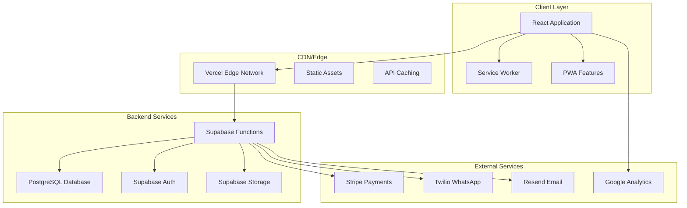
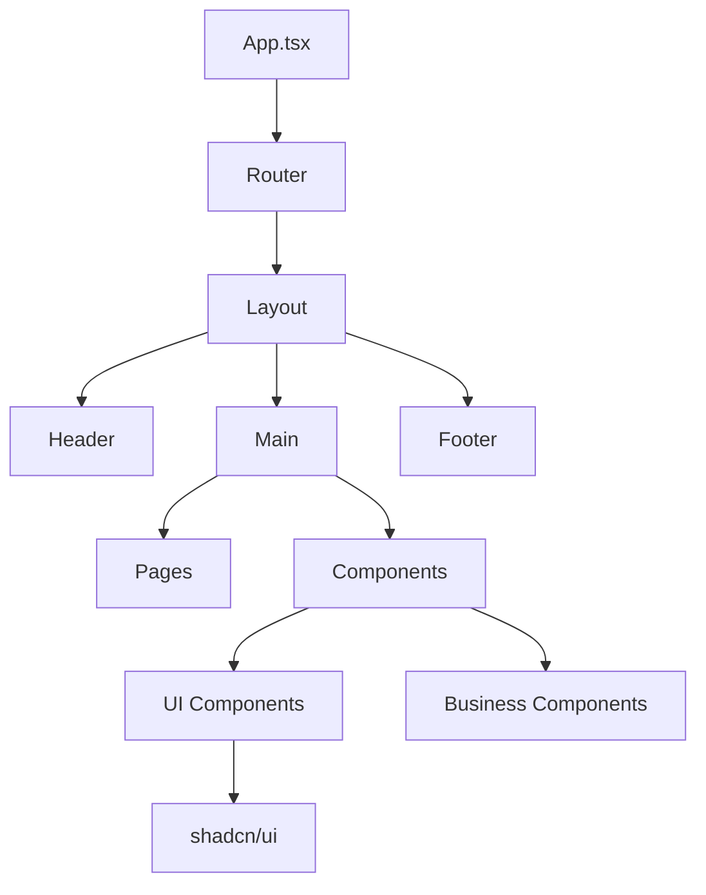
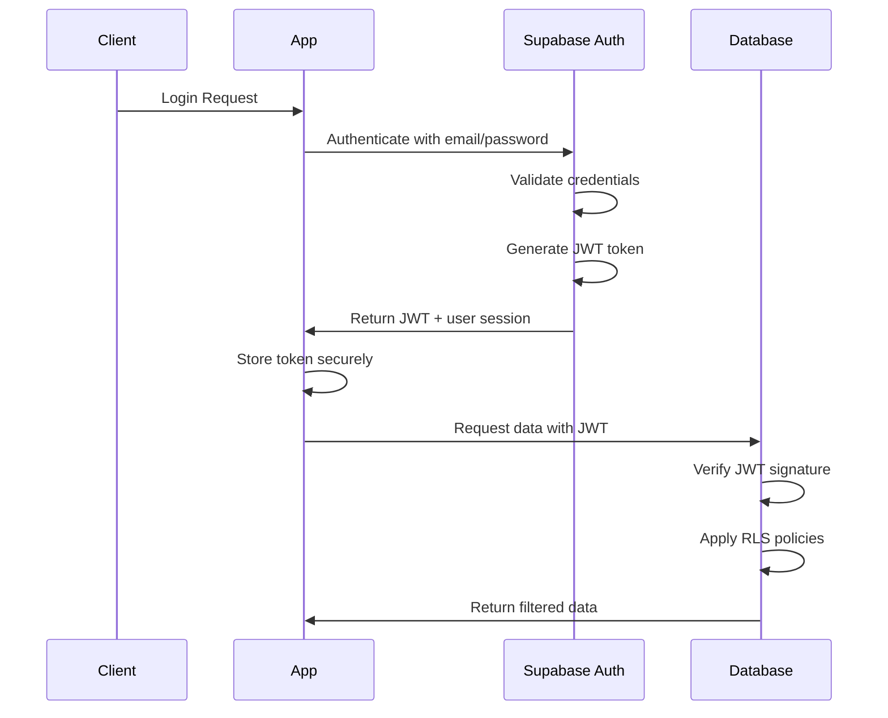
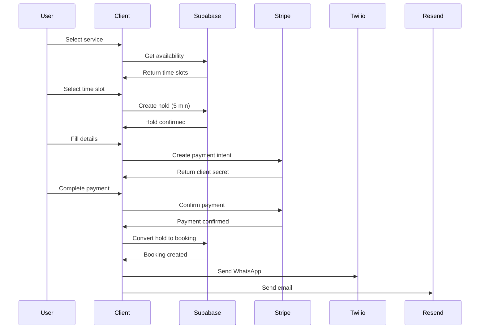
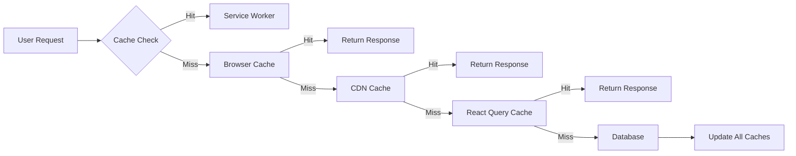
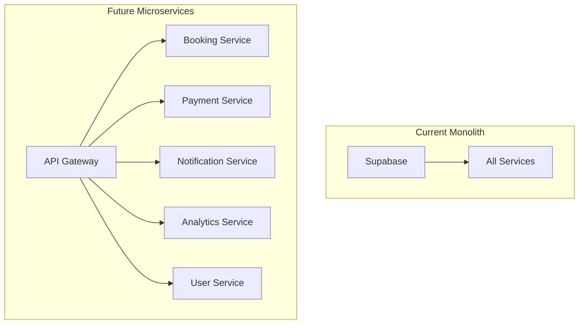
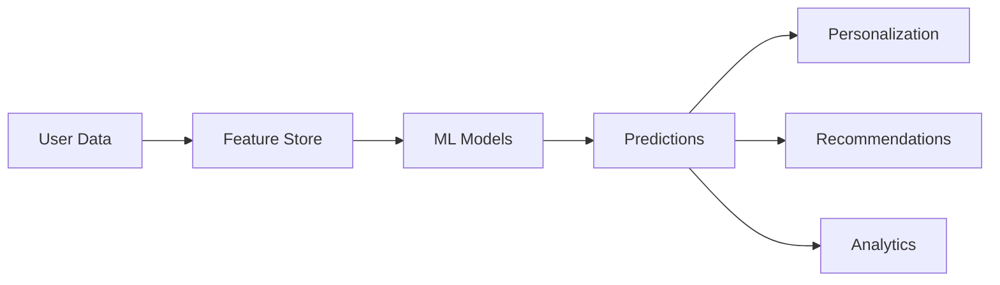

# Mariia Hub - Technical Architecture Documentation

## Overview

Mariia Hub is built on a modern, scalable technology stack designed for performance, security, and maintainability. The architecture follows best practices for React applications and leverages serverless technologies for optimal scalability and cost-efficiency.

## Architecture Philosophy

- **Mobile-First**: Responsive design with progressive enhancement
- **Performance-Optimized**: Sub-2 second load times, 95+ Lighthouse scores
- **Security-First**: Row-level security, encrypted communications, GDPR compliance
- **Scalable**: Cloud-native architecture with auto-scaling capabilities
- **Developer Experience**: TypeScript, hot reload, comprehensive testing

---

## 1. System Architecture

### 1.1 High-Level Architecture



### 1.2 Technology Stack

#### Frontend Stack
| Category | Technology | Version | Purpose |
|----------|------------|---------|---------|
| Framework | React | 18.3.1 | UI framework |
| Language | TypeScript | 5.6.3 | Type safety |
| Build Tool | Vite | 6.0.3 | Build system |
| Compiler | SWC | - | Fast compilation |
| UI Library | shadcn/ui | latest | Component library |
| CSS Framework | Tailwind CSS | 3.4.17 | Styling |
| State Management | Zustand | latest | Client state |
| Server State | TanStack Query | 5.61.0 | API state |
| Routing | React Router | 6.28.1 | Navigation |
| Forms | React Hook Form | latest | Form handling |
| Testing | Vitest | latest | Unit tests |
| E2E Testing | Playwright | latest | End-to-end tests |

#### Backend Stack
| Category | Technology | Purpose |
|----------|------------|---------|
| Database | PostgreSQL (Supabase) | Primary data store |
| Authentication | Supabase Auth | User management |
| File Storage | Supabase Storage | Asset management |
| Edge Functions | Supabase Edge Functions | Serverless compute |
| Real-time | Supabase Realtime | Live updates |
| API Layer | REST + WebSocket | Data access |

#### Infrastructure Stack
| Category | Technology | Purpose |
|----------|------------|---------|
| Hosting | Vercel | Frontend hosting |
| Database | Supabase Cloud | Backend services |
| CDN | Vercel Edge Network | Content delivery |
| Monitoring | Sentry | Error tracking |
| Analytics | Google Analytics | Usage tracking |
| Payments | Stripe | Payment processing |
| Communication | Twilio + Resend | Messaging |

---

## 2. Frontend Architecture

### 2.1 Component Architecture



### 2.2 Directory Structure

```
src/
├── components/           # Reusable UI components
│   ├── ui/              # Base UI components (shadcn/ui)
│   ├── booking/         # Booking flow components
│   ├── admin/           # Admin dashboard components
│   └── layout/          # Layout components
├── pages/               # Route components
│   ├── Index.tsx        # Homepage
│   ├── Beauty/          # Beauty services
│   ├── Fitness/         # Fitness programs
│   ├── Booking/         # Booking wizard
│   └── Admin/           # Admin pages
├── contexts/            # React contexts
│   ├── BookingContext.tsx
│   ├── CurrencyContext.tsx
│   └── ModeContext.tsx
├── hooks/               # Custom React hooks
├── lib/                 # Utility libraries
├── services/            # API services
├── stores/              # Zustand stores
├── types/               # TypeScript definitions
├── styles/              # Global styles
├── test/                # Test configuration
└── i18n/               # Internationalization
```

### 2.3 State Management Strategy

#### Client State (Zustand)
```typescript
// stores/bookingStore.ts
interface BookingState {
  // State
  currentStep: number;
  selectedService: Service | null;
  selectedTime: TimeSlot | null;
  clientInfo: ClientInfo | null;

  // Actions
  setStep: (step: number) => void;
  selectService: (service: Service) => void;
  selectTime: (time: TimeSlot) => void;
  updateClientInfo: (info: Partial<ClientInfo>) => void;
  resetBooking: () => void;
}
```

#### Server State (React Query)
```typescript
// hooks/useServices.ts
export const useServices = (category?: string) => {
  return useQuery({
    queryKey: ['services', category],
    queryFn: () => getServices(category),
    staleTime: 5 * 60 * 1000, // 5 minutes
    cacheTime: 10 * 60 * 1000, // 10 minutes
  });
};
```

### 2.4 Routing Architecture

```typescript
// App.tsx
const router = createBrowserRouter([
  {
    path: "/",
    element: <Layout />,
    children: [
      { index: true, element: <Index /> },
      { path: "beauty", element: <Beauty /> },
      { path: "beauty/:serviceId", element: <BeautyServiceDetail /> },
      { path: "fitness", element: <Fitness /> },
      { path: "fitness/:programId", element: <FitnessProgramDetail /> },
      {
        path: "booking",
        element: <BookingWizard />,
        children: [
          { path: "choose", element: <Step1Choose /> },
          { path: "time", element: <Step2Time /> },
          { path: "details", element: <Step3Details /> },
          { path: "payment", element: <Step4Payment /> },
        ]
      },
      { path: "admin", element: <Admin /> },
      { path: "about", element: <About /> },
      { path: "contact", element: <Contact /> },
      { path: "blog", element: <Blog /> },
      { path: "*", element: <NotFound /> },
    ]
  }
]);
```

### 2.5 Performance Optimizations

#### Code Splitting
```typescript
// Lazy loading for pages
const Index = lazy(() => import('../pages/Index'));
const Beauty = lazy(() => import('../pages/Beauty'));
const Fitness = lazy(() => import('../pages/Fitness'));
const Admin = lazy(() => import('../pages/Admin'));

// Route-based chunk splitting in vite.config.ts
manualChunks(id) {
  if (id.includes('/src/pages/')) {
    if (id.includes('/beauty/')) return 'beauty-routes';
    if (id.includes('/fitness/')) return 'fitness-routes';
    if (id.includes('/admin/')) return 'admin-routes';
  }
}
```

#### Bundle Optimization
- Tree shaking for unused code
- Dynamic imports for heavy dependencies
- Vendor chunk splitting
- Image optimization and lazy loading
- Service worker for caching

---

## 3. Backend Architecture

### 3.1 Database Schema

#### Core Tables

```sql
-- Services table
CREATE TABLE services (
  id UUID PRIMARY KEY DEFAULT gen_random_uuid(),
  name TEXT NOT NULL,
  description TEXT,
  category TEXT NOT NULL, -- 'beauty', 'fitness', 'lifestyle'
  price DECIMAL(10, 2) NOT NULL,
  duration INTEGER NOT NULL, -- minutes
  is_active BOOLEAN DEFAULT true,
  created_at TIMESTAMP DEFAULT now(),
  updated_at TIMESTAMP DEFAULT now()
);

-- Bookings table
CREATE TABLE bookings (
  id UUID PRIMARY KEY DEFAULT gen_random_uuid(),
  service_id UUID REFERENCES services(id),
  client_id UUID REFERENCES profiles(id),
  provider_id UUID REFERENCES profiles(id),
  scheduled_at TIMESTAMP NOT NULL,
  status TEXT NOT NULL DEFAULT 'pending', -- 'pending', 'confirmed', 'cancelled', 'completed'
  total_amount DECIMAL(10, 2) NOT NULL,
  paid BOOLEAN DEFAULT false,
  created_at TIMESTAMP DEFAULT now(),
  updated_at TIMESTAMP DEFAULT now()
);

-- Profiles table
CREATE TABLE profiles (
  id UUID REFERENCES auth.users(id) PRIMARY KEY,
  email TEXT UNIQUE,
  full_name TEXT,
  avatar_url TEXT,
  role TEXT DEFAULT 'client', -- 'client', 'provider', 'admin'
  preferences JSONB DEFAULT '{}',
  created_at TIMESTAMP DEFAULT now(),
  updated_at TIMESTAMP DEFAULT now()
);

-- Availability slots table
CREATE TABLE availability_slots (
  id UUID PRIMARY KEY DEFAULT gen_random_uuid(),
  provider_id UUID REFERENCES profiles(id),
  start_time TIMESTAMP NOT NULL,
  end_time TIMESTAMP NOT NULL,
  is_booked BOOLEAN DEFAULT false,
  booking_id UUID REFERENCES bookings(id),
  created_at TIMESTAMP DEFAULT now()
);
```

#### Supporting Tables

```sql
-- Service content table
CREATE TABLE service_content (
  id UUID PRIMARY KEY DEFAULT gen_random_uuid(),
  service_id UUID REFERENCES services(id),
  content_type TEXT NOT NULL, -- 'preparation', 'aftercare', 'contraindications'
  content JSONB NOT NULL,
  locale TEXT DEFAULT 'en',
  created_at TIMESTAMP DEFAULT now()
);

-- Service gallery table
CREATE TABLE service_gallery (
  id UUID PRIMARY KEY DEFAULT gen_random_uuid(),
  service_id UUID REFERENCES services(id),
  image_url TEXT NOT NULL,
  caption TEXT,
  order_index INTEGER,
  created_at TIMESTAMP DEFAULT now()
);

-- Booking drafts table (for session persistence)
CREATE TABLE booking_drafts (
  id UUID PRIMARY KEY DEFAULT gen_random_uuid(),
  session_id TEXT UNIQUE NOT NULL,
  draft_data JSONB NOT NULL,
  expires_at TIMESTAMP NOT NULL,
  created_at TIMESTAMP DEFAULT now()
);
```

### 3.2 Security Architecture

#### Row Level Security (RLS)
```sql
-- RLS Policy for bookings
CREATE POLICY "Users can view own bookings" ON bookings
  FOR SELECT USING (
    auth.uid() = client_id OR
    auth.uid() = provider_id OR
    EXISTS (
      SELECT 1 FROM profiles
      WHERE id = auth.uid() AND role = 'admin'
    )
  );

-- RLS Policy for services
CREATE POLICY "Everyone can view active services" ON services
  FOR SELECT USING (is_active = true);

-- RLS Policy for profiles
CREATE POLICY "Users can view public profile info" ON profiles
  FOR SELECT USING (
    id = auth.uid() OR
    role IN ('provider', 'admin')
  );
```

#### Authentication Flow


### 3.3 API Design

#### RESTful Endpoints
```typescript
// services/bookingService.ts
export const bookingService = {
  // Get available time slots
  getAvailability: async (serviceId: string, date: string) => {
    const { data } = await supabase
      .from('availability_slots')
      .select('*')
      .eq('service_id', serviceId)
      .gte('start_time', date)
      .lt('start_time', addDays(date, 1))
      .eq('is_booked', false)
      .order('start_time');
    return data;
  },

  // Create booking
  createBooking: async (booking: CreateBookingRequest) => {
    // Start transaction
    const { data, error } = await supabase.rpc('create_booking_with_hold', {
      p_service_id: booking.serviceId,
      p_client_id: booking.clientId,
      p_time_slot: booking.timeSlot,
    });

    if (error) throw error;
    return data;
  },

  // Update booking status
  updateStatus: async (bookingId: string, status: BookingStatus) => {
    const { data } = await supabase
      .from('bookings')
      .update({ status, updated_at: new Date().toISOString() })
      .eq('id', bookingId)
      .select()
      .single();
    return data;
  },
};
```

#### Real-time Subscriptions
```typescript
// hooks/useRealtimeBookings.ts
export const useRealtimeBookings = (userId: string) => {
  useEffect(() => {
    const subscription = supabase
      .channel('bookings')
      .on(
        'postgres_changes',
        {
          event: '*',
          schema: 'public',
          table: 'bookings',
          filter: `client_id=eq.${userId}`,
        },
        (payload) => {
          // Handle booking updates
          queryClient.invalidateQueries(['bookings', userId]);
        }
      )
      .subscribe();

    return () => subscription.unsubscribe();
  }, [userId]);
};
```

### 3.4 Edge Functions

#### Booking Confirmation Function
```typescript
// supabase/functions/booking-confirmation/index.ts
import { serve } from 'https://deno.land/std@0.168.0/http/server.ts';
import { createClient } from 'https://esm.sh/@supabase/supabase-js@2';

serve(async (req) => {
  try {
    const { bookingId } = await req.json();

    // Initialize Supabase client
    const supabase = createClient(
      Deno.env.get('SUPABASE_URL')!,
      Deno.env.get('SUPABASE_SERVICE_ROLE_KEY')!
    );

    // Get booking details
    const { data: booking } = await supabase
      .from('bookings')
      .select(`
        *,
        services(*),
        client:profiles!bookings_client_id_fkey(*),
        provider:profiles!bookings_provider_id_fkey(*)
      `)
      .eq('id', bookingId)
      .single();

    // Send WhatsApp notification
    await fetch('https://api.twilio.com/2010-04-01/Accounts/.../Messages.json', {
      method: 'POST',
      headers: {
        'Authorization': `Basic ${btoa(`${TWILIO_SID}:${TWILIO_TOKEN}`)}`,
        'Content-Type': 'application/x-www-form-urlencoded',
      },
      body: new URLSearchParams({
        From: 'whatsapp:+14155238886',
        To: `whatsapp:${booking.client.phone}`,
        Body: `Your booking for ${booking.services.name} has been confirmed!`,
      }),
    });

    // Send email confirmation
    await resend.emails.send({
      from: 'noreply@mariia-hub.com',
      to: [booking.client.email],
      subject: 'Booking Confirmation',
      html: generateBookingConfirmationEmail(booking),
    });

    return new Response(JSON.stringify({ success: true }), {
      headers: { 'Content-Type': 'application/json' },
      status: 200,
    });
  } catch (error) {
    return new Response(JSON.stringify({ error: error.message }), {
      headers: { 'Content-Type': 'application/json' },
      status: 500,
    });
  }
});
```

---

## 4. Data Flow Architecture

### 4.1 Booking Flow Data Flow



### 4.2 Real-time Data Synchronization

```typescript
// Real-time booking status updates
const subscription = supabase
  .channel('booking-updates')
  .on(
    'postgres_changes',
    {
      event: 'UPDATE',
      schema: 'public',
      table: 'bookings',
      filter: 'id=eq.' + bookingId
    },
    (payload) => {
      // Update local state
      setBookingStatus(payload.new.status);

      // Show notification
      if (payload.new.status === 'confirmed') {
        toast.success('Booking confirmed!');
      }
    }
  )
  .subscribe();
```

### 4.3 Caching Strategy

#### React Query Configuration
```typescript
// queryClient.ts
export const queryClient = new QueryClient({
  defaultOptions: {
    queries: {
      staleTime: 5 * 60 * 1000, // 5 minutes
      cacheTime: 10 * 60 * 1000, // 10 minutes
      retry: 3,
      retryDelay: attemptIndex => Math.min(1000 * 2 ** attemptIndex, 30000),
      refetchOnWindowFocus: false,
      refetchOnReconnect: true,
    },
    mutations: {
      retry: 1,
    },
  },
});
```

#### Service Worker Caching
```typescript
// sw.ts
self.addEventListener('fetch', event => {
  if (event.request.destination === 'image') {
    event.respondWith(
      caches.match(event.request).then(response => {
        return response || fetch(event.request).then(fetchResponse => {
          const responseClone = fetchResponse.clone();
          caches.open('v1/images').then(cache => {
            cache.put(event.request, responseClone);
          });
          return fetchResponse;
        });
      })
    );
  }
});
```

---

## 5. Security Implementation

### 5.1 Authentication & Authorization

#### JWT Token Management
```typescript
// auth/authConfig.ts
export const authConfig = {
  // Token storage
  storage: {
    key: 'sb-auth-token',
    storage: localStorage,
  },

  // Token refresh
  refreshThreshold: 5 * 60 * 1000, // 5 minutes before expiry

  // Session management
  sessionTimeout: 24 * 60 * 60 * 1000, // 24 hours

  // Multi-factor auth (future feature)
  mfa: {
    enabled: false,
    methods: ['totp', 'sms'],
  },
};
```

#### Role-Based Access Control
```typescript
// hooks/useAuthorization.ts
export const useAuthorization = (requiredRole: UserRole) => {
  const { user } = useAuth();

  const roleHierarchy = {
    client: 0,
    provider: 1,
    admin: 2,
  };

  const userRole = user?.role as UserRole;
  const hasAccess = roleHierarchy[userRole] >= roleHierarchy[requiredRole];

  return { hasAccess, userRole };
};
```

### 5.2 Data Protection

#### Encryption at Rest
- Database encryption: AES-256
- File storage encryption: Server-side encryption
- Backup encryption: Encrypted snapshots

#### Encryption in Transit
- TLS 1.3 for all communications
- API endpoints enforce HTTPS
- WebSocket connections secured

#### GDPR Compliance
```typescript
// gdpr/dataManagement.ts
export const gdprConfig = {
  // Data retention
  retentionPeriod: {
    bookings: 7 * 365, // 7 years
    userProfiles: 365 * 365, // Forever until deletion
    analytics: 2 * 365, // 2 years
  },

  // Data portability
  exportFormats: ['json', 'csv', 'pdf'],

  // Consent management
  consentTypes: [
    'marketing',
    'analytics',
    'communication',
    'cookies',
  ],

  // Anonymization
  anonymizeAfter: 365, // days
};
```

### 5.3 API Security

#### Rate Limiting
```typescript
// middleware/rateLimit.ts
export const rateLimitConfig = {
  // General API limits
  default: {
    windowMs: 15 * 60 * 1000, // 15 minutes
    max: 100, // requests per window
  },

  // Booking endpoint limits
  booking: {
    windowMs: 60 * 1000, // 1 minute
    max: 5, // bookings per minute
  },

  // Auth endpoint limits
  auth: {
    windowMs: 15 * 60 * 1000, // 15 minutes
    max: 10, // auth attempts per window
  },
};
```

#### Input Validation
```typescript
// validation/schemas.ts
export const bookingSchema = z.object({
  serviceId: z.string().uuid(),
  timeSlot: z.string().datetime(),
  clientInfo: z.object({
    firstName: z.string().min(2).max(50),
    lastName: z.string().min(2).max(50),
    email: z.string().email(),
    phone: z.string().regex(/^\+?[1-9]\d{1,14}$/),
    notes: z.string().max(500).optional(),
  }),
});

// API validation
app.post('/api/bookings', validateRequest(bookingSchema), async (req, res) => {
  // Process validated booking
});
```

---

## 6. Performance Optimization

### 6.1 Frontend Performance

#### Bundle Optimization
```typescript
// vite.config.ts
export default defineConfig({
  build: {
    rollupOptions: {
      output: {
        manualChunks: {
          // React ecosystem
          'react-vendor': ['react', 'react-dom'],

          // UI libraries
          'ui-vendor': ['@radix-ui/react-dialog', '@radix-ui/react-dropdown-menu'],

          // Charts
          'charts-vendor': ['recharts'],

          // Utilities
          'utils-vendor': ['clsx', 'class-variance-authority', 'tailwind-merge'],
        },
      },
    },

    // Minification
    minify: 'terser',
    terserOptions: {
      compress: {
        drop_console: true,
        drop_debugger: true,
      },
    },
  },
});
```

#### Image Optimization
```typescript
// components/OptimizedImage.tsx
interface OptimizedImageProps {
  src: string;
  alt: string;
  width?: number;
  height?: number;
  priority?: boolean;
}

export const OptimizedImage: React.FC<OptimizedImageProps> = ({
  src,
  alt,
  width,
  height,
  priority = false,
}) => {
  const [loaded, setLoaded] = useState(false);

  return (
    <div className="relative overflow-hidden">
       setLoaded(true)}
      />
      {!loaded && (
        <div className="absolute inset-0 bg-gray-200 animate-pulse" />
      )}
    </div>
  );
};
```

### 6.2 Backend Performance

#### Database Optimization
```sql
-- Indexes for performance
CREATE INDEX idx_bookings_client_id ON bookings(client_id);
CREATE INDEX idx_bookings_provider_id ON bookings(provider_id);
CREATE INDEX idx_bookings_status ON bookings(status);
CREATE INDEX idx_availability_slots_time ON availability_slots(start_time);
CREATE INDEX idx_services_category ON services(category);

-- Partitioning for large tables
CREATE TABLE bookings_2024 PARTITION OF bookings
  FOR VALUES FROM ('2024-01-01') TO ('2025-01-01');
```

#### Connection Pooling
```typescript
// supabaseClient.ts
import { createClient } from '@supabase/supabase-js';

const supabaseUrl = process.env.REACT_APP_SUPABASE_URL!;
const supabaseAnonKey = process.env.REACT_APP_SUPABASE_ANON_KEY!;

export const supabase = createClient(supabaseUrl, supabaseAnonKey, {
  // Connection pooling
  db: {
    poolSize: 10,
    connectionTimeoutMillis: 10000,
  },

  // Real-time configuration
  realtime: {
    params: {
      eventsPerSecond: 10,
    },
  },
});
```

### 6.3 Caching Strategy

#### Multi-level Caching


#### Cache Implementation
```typescript
// cache/cacheStrategy.ts
export const cacheConfig = {
  // Service Worker cache
  serviceWorker: {
    runtimeCaching: [
      {
        urlPattern: /^https:\/\/api\./,
        handler: 'StaleWhileRevalidate',
        options: {
          cacheName: 'api-cache',
          expiration: {
            maxEntries: 100,
            maxAgeSeconds: 60 * 5, // 5 minutes
          },
        },
      },
      {
        urlPattern: /\.(?:png|jpg|jpeg|svg|webp)$/,
        handler: 'CacheFirst',
        options: {
          cacheName: 'image-cache',
          expiration: {
            maxEntries: 200,
            maxAgeSeconds: 60 * 60 * 24 * 30, // 30 days
          },
        },
      },
    ],
  },

  // React Query cache
  queryClient: {
    defaultStaleTime: 5 * 60 * 1000, // 5 minutes
    defaultCacheTime: 10 * 60 * 1000, // 10 minutes
  },
};
```

---

## 7. Monitoring & Observability

### 7.1 Error Tracking

#### Sentry Configuration
```typescript
// sentry.ts
import * as Sentry from '@sentry/react';
import { Integrations } from '@sentry/tracing';

Sentry.init({
  dsn: process.env.REACT_APP_SENTRY_DSN,
  integrations: [
    new Integrations.BrowserTracing(),
  ],

  // Performance monitoring
  tracesSampleRate: 0.1,

  // Error reporting
  environment: process.env.NODE_ENV,
  debug: process.env.NODE_ENV === 'development',

  // Release tracking
  release: `mariia-hub@${process.env.npm_package_version}`,

  // User context
  beforeSend: (event, hint) => {
    // Add user context if available
    const user = getCurrentUser();
    if (user) {
      event.user = {
        id: user.id,
        email: user.email,
        role: user.role,
      };
    }
    return event;
  },
});
```

### 7.2 Performance Monitoring

#### Web Vitals
```typescript
// analytics/webVitals.ts
import { getCLS, getFID, getFCP, getLCP, getTTFB } from 'web-vitals';

function sendToAnalytics(metric) {
  // Send to Google Analytics
  gtag('event', metric.name, {
    value: Math.round(metric.name === 'CLS' ? metric.value * 1000 : metric.value),
    event_category: 'Web Vitals',
    event_label: metric.id,
    non_interaction: true,
  });

  // Send to custom analytics
  fetch('/api/vitals', {
    method: 'POST',
    headers: { 'Content-Type': 'application/json' },
    body: JSON.stringify(metric),
  });
}

getCLS(sendToAnalytics);
getFID(sendToAnalytics);
getFCP(sendToAnalytics);
getLCP(sendToAnalytics);
getTTFB(sendToAnalytics);
```

### 7.3 Custom Analytics

#### Business Metrics Tracking
```typescript
// analytics/businessMetrics.ts
export const trackBookingEvent = (event: string, properties: any) => {
  // Track booking funnel events
  analytics.track(event, {
    category: 'booking',
    timestamp: new Date().toISOString(),
    ...properties,
  });

  // Send to backend for analysis
  fetch('/api/analytics/events', {
    method: 'POST',
    headers: { 'Content-Type': 'application/json' },
    body: JSON.stringify({
      event,
      properties,
      userId: getCurrentUser()?.id,
      sessionId: getSessionId(),
    }),
  });
};

// Usage examples
trackBookingEvent('Booking Started', {
  serviceCategory: 'beauty',
  serviceName: 'Lip Enhancement',
});

trackBookingEvent('Payment Completed', {
  bookingId: booking.id,
  amount: booking.totalAmount,
  currency: booking.currency,
});
```

---

## 8. Deployment Architecture

### 8.1 CI/CD Pipeline

```yaml
# .github/workflows/deploy.yml
name: Deploy to Production

on:
  push:
    branches: [main]

jobs:
  test:
    runs-on: ubuntu-latest
    steps:
      - uses: actions/checkout@v3
      - uses: actions/setup-node@v3
        with:
          node-version: '18'
          cache: 'npm'

      - name: Install dependencies
        run: npm ci

      - name: Run tests
        run: npm run test:ci

      - name: Run E2E tests
        run: npm run test:e2e:ci

      - name: Build application
        run: npm run build

      - name: Bundle analysis
        run: npm run build:analyze

  deploy:
    needs: test
    runs-on: ubuntu-latest
    steps:
      - name: Deploy to Vercel
        uses: amondnet/vercel-action@v20
        with:
          vercel-token: ${{ secrets.VERCEL_TOKEN }}
          vercel-org-id: ${{ secrets.ORG_ID }}
          vercel-project-id: ${{ secrets.PROJECT_ID }}
          scope: ${{ secrets.VERCEL_ORG_ID }}
```

### 8.2 Environment Configuration

#### Development Environment
```typescript
// .env.development
VITE_SUPABASE_URL=https://dev-project.supabase.co
VITE_SUPABASE_ANON_KEY=dev-anon-key
VITE_STRIPE_PUBLISHABLE_KEY=pk_test_dev_key
VITE_GTM_CONTAINER_ID=GTM-DEV
VITE_SENTRY_DSN=https://dev-sentry-dsn
VITE_APP_ENV=development
```

#### Production Environment
```typescript
// .env.production
VITE_SUPABASE_URL=https://prod-project.supabase.co
VITE_SUPABASE_ANON_KEY=prod-anon-key
VITE_STRIPE_PUBLISHABLE_KEY=pk_live_prod_key
VITE_GTM_CONTAINER_ID=GTM-PROD
VITE_SENTRY_DSN=https://prod-sentry-dsn
VITE_APP_ENV=production
```

### 8.3 Scaling Strategy

#### Horizontal Scaling
- **Frontend**: Vercel Edge Network (automatic global distribution)
- **Backend**: Supabase (auto-scaling PostgreSQL)
- **Functions**: Supabase Edge Functions (serverless scaling)

#### Vertical Scaling
- **Database**: Connection pooling + read replicas
- **Cache**: Redis cluster for session storage
- **CDN**: Increased edge locations

---

## 9. Future Architecture Considerations

### 9.1 Microservices Migration



### 9.2 Mobile Applications

#### React Native Architecture
```typescript
// Shared packages structure
packages/
├── core/           # Shared business logic
├── ui/             # Shared UI components
├── api/            # Shared API client
├── utils/          # Shared utilities
├── web/            # Web application
├── ios/            # iOS application
└── android/        # Android application
```

### 9.3 AI/ML Integration

#### Architecture for AI Features


---

## 10. Documentation Standards

### 10.1 Code Documentation

#### TypeScript Documentation
```typescript
/**
 * Creates a new booking with payment processing
 *
 * @param params - Booking parameters
 * @param params.serviceId - UUID of the service to book
 * @param params.timeSlot - ISO datetime string for the appointment
 * @param params.clientInfo - Client information and preferences
 * @returns Promise<Booking> - Created booking object
 *
 * @throws {ValidationError} When client info is invalid
 * @throws {PaymentError} When payment fails
 * @throws {AvailabilityError} When time slot is no longer available
 *
 * @example
 * ```typescript
 * const booking = await createBooking({
 *   serviceId: '123e4567-e89b-12d3-a456-426614174000',
 *   timeSlot: '2024-01-15T14:00:00Z',
 *   clientInfo: {
 *     firstName: 'Anna',
 *     email: 'anna@example.com',
 *     phone: '+48123456789'
 *   }
 * });
 * ```
 */
export const createBooking = async (params: CreateBookingParams): Promise<Booking> => {
  // Implementation
};
```

### 10.2 API Documentation

#### OpenAPI Specification
```yaml
# api-spec.yaml
openapi: 3.0.0
info:
  title: Mariia Hub API
  version: 1.0.0
  description: Beauty and fitness booking platform API

paths:
  /api/bookings:
    post:
      summary: Create a new booking
      requestBody:
        required: true
        content:
          application/json:
            schema:
              $ref: '#/components/schemas/CreateBookingRequest'
      responses:
        '201':
          description: Booking created successfully
          content:
            application/json:
              schema:
                $ref: '#/components/schemas/Booking'
        '400':
          description: Bad request
        '402':
          description: Payment required
```

---

## Conclusion

The Mariia Hub technical architecture is designed to be:
- **Scalable**: Handles growth from startup to enterprise scale
- **Performant**: Sub-2 second load times, 95+ Lighthouse scores
- **Secure**: Enterprise-grade security with GDPR compliance
- **Maintainable**: Clean code, comprehensive testing, thorough documentation
- **Future-proof**: Ready for microservices, mobile apps, and AI integration

The architecture supports the business requirements for a premium beauty and fitness booking platform while maintaining flexibility for future enhancements and scaling needs.

---

**Document Version**: 1.0
**Last Updated**: 2025-01-22
**Next Review**: 2025-04-22