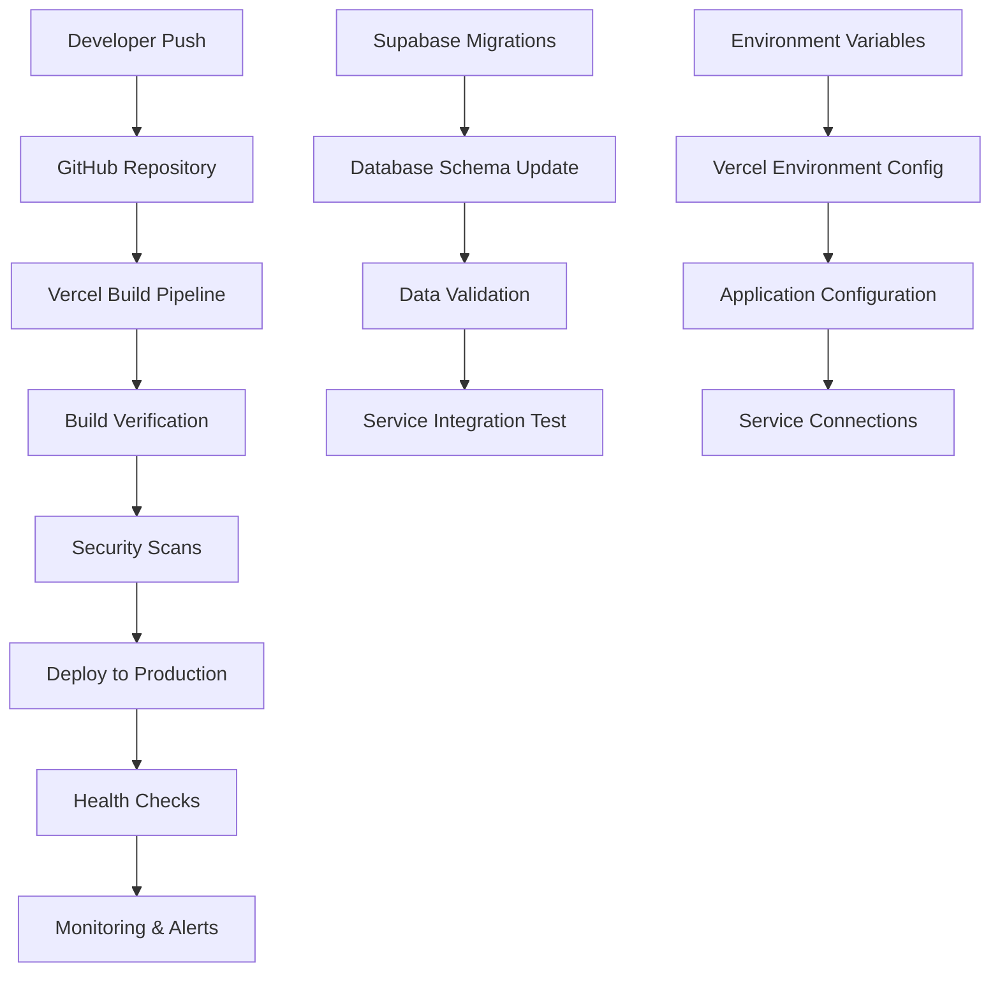

# Mariia Hub Platform - Deployment Playbook

**Version:** 1.0
**Last Updated:** 2025-10-30
**Owner:** DevOps Team
**Review Date:** Monthly

## Overview

This playbook provides comprehensive procedures for deploying the Mariia Hub platform to production, staging, and development environments. It covers all aspects of the deployment lifecycle from preparation through verification and rollback.

## Table of Contents

1. [Environment Overview](#environment-overview)
2. [Deployment Architecture](#deployment-architecture)
3. [Pre-Deployment Requirements](#pre-deployment-requirements)
4. [Deployment Procedures](#deployment-procedures)
5. [Post-Deployment Verification](#post-deployment-verification)
6. [Rollback Procedures](#rollback-procedures)
7. [Troubleshooting](#troubleshooting)
8. [Security Considerations](#security-considerations)

## Environment Overview

### Production Environment
- **Domain:** mariaborysevych.com
- **Hosting:** Vercel (Frontend) + Supabase (Backend)
- **Region:** European Union (Frankfurt)
- **CDN:** Vercel Edge Network
- **Database:** Supabase PostgreSQL (Production)

### Staging Environment
- **Domain:** staging.mariaborysevych.com
- **Hosting:** Vercel Preview Deployments
- **Database:** Supabase Preview Branch
- **Purpose:** Pre-production testing

### Development Environment
- **Domain:** localhost:8080
- **Hosting:** Local development
- **Database:** Supabase Local Instance
- **Purpose:** Development and testing

## Deployment Architecture



## Pre-Deployment Requirements

### Prerequisites Checklist

#### Code Quality and Testing
- [ ] All tests passing: `npm run test`
- [ ] E2E tests passing: `npm run test:e2e`
- [ ] Code coverage > 80%
- [ ] ESLint passing: `npm run lint`
- [ ] TypeScript compilation successful
- [ ] Security audit passed: `npm run security-audit`

#### Environment Configuration
- [ ] Environment variables verified in Vercel dashboard
- [ ] Supabase migrations tested on staging
- [ ] Database types generated: `supabase gen types typescript`
- [ ] Feature flags configured and tested
- [ ] SSL certificates valid (auto-managed by Vercel)

#### Performance and Security
- [ ] Bundle size analysis completed: `npm run build:analyze`
- [ ] Performance tests passing (Lighthouse score > 95)
- [ ] Security scan completed with no critical issues
- [ ] Image optimization verified
- [ ] Service worker functionality tested

#### Communication and Coordination
- [ ] Stakeholder notification sent (24 hours prior)
- [ ] Maintenance window scheduled
- [ ] Team availability confirmed
- [ ] Rollback plan documented and tested
- [ ] Emergency contact list updated

### Environment-Specific Requirements

#### Production Deployment
- **Required Approvals:**
  - Technical Lead approval
  - Product Manager approval
  - Security team review (for major changes)

- **Timing:**
  - Preferred: Tuesday-Thursday, 10:00-14:00 CET
  - Avoid: Friday afternoon, weekends, holidays
  - Minimum 2-hour maintenance window

#### Staging Deployment
- **Required Approvals:** Technical Lead only
- **Timing:** Any time during business hours
- **Purpose:** User acceptance testing, integration testing

## Deployment Procedures

### 1. Standard Production Deployment

#### Step 1: Preparation (5 minutes)
```bash
# 1.1 Sync with main branch
git checkout main
git pull origin main

# 1.2 Verify latest commit
git log --oneline -1

# 1.3 Check for uncommitted changes
git status --porcelain
# Should return empty

# 1.4 Run pre-deployment checks
npm run build
npm run test
```

#### Step 2: Create Deployment Branch (2 minutes)
```bash
# 2.1 Create deployment branch
git checkout -b deploy/$(date +%Y-%m-%d-%H%M%S)

# 2.2 Tag deployment
git tag -a "v$(date +%Y.%m.%d)" -m "Production deployment $(date)"
```

#### Step 3: Database Migration (10-15 minutes)
```bash
# 3.1 Backup current database
npx supabase db dump --project-ref $VITE_SUPABASE_PROJECT_ID > "backup-$(date +%Y%m%d-%H%M%S).sql"

# 3.2 Apply migrations to staging first
npm run db:migrate:staging

# 3.3 Verify staging migration
npm run test:integration:staging

# 3.4 Apply migrations to production
npx supabase db push --project-ref $VITE_SUPABASE_PROJECT_ID

# 3.5 Verify production migration
npx supabase migration list --project-ref $VITE_SUPABASE_PROJECT_ID
```

#### Step 4: Frontend Deployment (5-10 minutes)
```bash
# 4.1 Deploy to Vercel
vercel --prod --confirm

# 4.2 Monitor deployment progress
vercel logs --follow
```

#### Step 5: Service Integration (5 minutes)
```bash
# 5.1 Verify Supabase connection
curl -X POST https://mariaborysevych.com/api/health-check

# 5.2 Test Stripe integration
npm run test:stripe:production

# 5.3 Verify Booksy synchronization
npm run test:booksy:sync
```

### 2. Hotfix Deployment

#### Emergency Hotfix Procedure
```bash
# 1. Create hotfix branch from main
git checkout main
git pull origin main
git checkout -b hotfix/$(date +%Y%m%d)-description

# 2. Apply minimal changes
# Make only the necessary fixes

# 3. Test changes locally
npm run build
npm run test
npm run test:e2e

# 4. Deploy to staging for verification
vercel --scope $VERCEL_ORG_ID
# Manual verification required

# 5. Deploy to production
git checkout main
git merge hotfix/$(date +%Y%m%d)-description
git push origin main
vercel --prod

# 6. Clean up
git branch -d hotfix/$(date +%Y%m%d)-description
```

### 3. Blue-Green Deployment (Major Updates)

#### Phase 1: Green Environment Setup
```bash
# 1.1 Create green deployment
vercel --scope $VERCEL_ORG_ID --name "mariia-hub-green"

# 1.2 Deploy to green environment
npm run build:production
vercel --prod --name "mariia-hub-green"

# 1.3 Configure green environment
# Set up environment variables
# Configure database connection to staging
# Test all integrations
```

#### Phase 2: Verification
```bash
# 2.1 Health checks
curl https://mariia-hub-green.vercel.app/api/health-check

# 2.2 Load testing
npm run test:load:green-environment

# 2.3 User acceptance testing
# Provide URL to QA team for testing
```

#### Phase 3: Traffic Switch
```bash
# 3.1 Update DNS to point to green environment
# Done via Vercel dashboard or API

# 3.2 Monitor for issues
npm run monitoring:watch

# 3.3 If issues detected, rollback immediately
# See rollback procedures below
```

## Post-Deployment Verification

### Automated Verification Checklist

#### Health Checks (Immediate)
```bash
# 1. Application health
curl -f https://mariaborysevych.com/api/health-check

# 2. Database connectivity
npm run test:db:connection

# 3. External services
npm run test:integrations

# 4. Performance metrics
npm run lighthouse:audit
```

#### Functional Tests (5-10 minutes)
```bash
# 1. Core booking flow
npm run test:e2e:booking-flow

# 2. User authentication
npm run test:e2e:authentication

# 3. Payment processing
npm run test:e2e:payment

# 4. Admin dashboard
npm run test:e2e:admin
```

#### Performance Validation (10 minutes)
```bash
# 1. Page load times
npm run performance:audit

# 2. Core Web Vitals
npm run cwv:check

# 3. Bundle size verification
npm run analyze:bundle

# 4. API response times
npm run test:api:performance
```

### Manual Verification Checklist

#### Critical User Journeys
- [ ] Homepage loads correctly
- [ ] Service browsing works
- [ ] Booking wizard completes successfully
- [ ] Payment processing functions
- [ ] User registration/login works
- [ ] Admin dashboard accessible
- [ ] Mobile responsive design

#### Business Logic Verification
- [ ] Pricing calculations correct
- [ ] Availability checking functional
- [ ] Email notifications sending
- [ ] Data persistence working
- [ ] Cross-device synchronization

#### Integration Verification
- [ ] Supabase database connection
- [ ] Stripe payment processing
- [ ] Booksy synchronization
- [ ] Google Analytics tracking
- [ ] Newsletter service integration

### Performance Benchmarks

#### Required Metrics
- **First Contentful Paint:** < 1.5 seconds
- **Largest Contentful Paint:** < 2.5 seconds
- **Time to Interactive:** < 3.5 seconds
- **Cumulative Layout Shift:** < 0.1
- **First Input Delay:** < 100ms

#### Monitoring Setup
```bash
# 1. Enable enhanced monitoring
npm run monitoring:enable

# 2. Set up alerts
npm run alerts:configure

# 3. Baseline metrics
npm run monitoring:baseline
```

## Rollback Procedures

### Immediate Rollback (Critical Issues)

#### Automatic Rollback
```bash
# 1. Use Vercel rollback (if recent deployment)
vercel rollback [deployment-url]

# 2. Monitor rollback progress
vercel logs --follow
```

#### Manual Rollback
```bash
# 1. Identify last stable commit
git log --oneline -10

# 2. Checkout stable commit
git checkout [stable-commit-hash]

# 3. Force push to main
git push origin main --force

# 4. Redeploy
vercel --prod --force

# 5. Verify rollback
curl https://mariaborysevych.com/api/health-check
```

### Database Rollback

#### Migration Rollback
```bash
# 1. Identify problematic migration
supabase migration list --project-ref $VITE_SUPABASE_PROJECT_ID

# 2. Create rollback migration
supabase migration new rollback-$(date +%Y%m%d)

# 3. Write rollback SQL
# Edit the generated migration file

# 4. Apply rollback
supabase db push --project-ref $VITE_SUPABASE_PROJECT_ID
```

#### Database Restore
```bash
# 1. Use backup if rollback not possible
supabase db restore \
  --project-ref $VITE_SUPABASE_PROJECT_ID \
  --backup-url [backup-url]

# 2. Verify data integrity
npm run test:data:integrity
```

### Feature Flag Rollback

#### Emergency Feature Disable
```bash
# 1. Access feature flag management
# Via Supabase dashboard or API

# 2. Disable problematic feature
curl -X POST https://mariaborysevych.com/api/admin/features/[feature-name]/disable \
  -H "Authorization: Bearer $ADMIN_TOKEN"

# 3. Verify feature disabled
npm run test:feature:disabled
```

## Troubleshooting

### Common Deployment Issues

#### Build Failures
**Symptoms:**
- Vercel build fails
- TypeScript compilation errors
- Missing dependencies

**Solutions:**
```bash
# 1. Check build locally
npm run build:production

# 2. Clear dependencies
rm -rf node_modules package-lock.json
npm install

# 3. Update dependencies
npm update

# 4. Check Node.js version
node --version  # Should match Vercel environment
```

#### Environment Variable Issues
**Symptoms:**
- API connection failures
- Authentication errors
- Configuration errors

**Solutions:**
```bash
# 1. Verify environment variables
vercel env ls

# 2. Pull latest environment
vercel env pull .env.production

# 3. Test configuration locally
npm run test:config:production
```

#### Database Connection Issues
**Symptoms:**
- Database timeouts
- Connection refused errors
- Migration failures

**Solutions:**
```bash
# 1. Check database status
supabase status --project-ref $VITE_SUPABASE_PROJECT_ID

# 2. Test connection
npm run test:db:connection

# 3. Check connection pooling
# Verify in Supabase dashboard
```

#### Performance Degradation
**Symptoms:**
- Slow page loads
- High response times
- Memory errors

**Solutions:**
```bash
# 1. Analyze bundle size
npm run build:analyze

# 2. Check database queries
supabase db debug --project-ref $VITE_SUPABASE_PROJECT_ID

# 3. Monitor resource usage
vercel logs --since=1h
```

### Debugging Commands

#### Application Debugging
```bash
# 1. Check application logs
vercel logs --limit=100 --since=10m

# 2. Monitor real-time logs
vercel logs --follow

# 3. Debug specific deployment
vercel logs [deployment-url]

# 4. Check function logs
vercel logs --filter=function
```

#### Database Debugging
```bash
# 1. Check query performance
supabase db debug --project-ref $VITE_SUPABASE_PROJECT_ID

# 2. Monitor connections
supabase status --project-ref $VITE_SUPABASE_PROJECT_ID

# 3. Check row count
npx supabase db shell --command "SELECT count(*) FROM bookings;"
```

#### Performance Debugging
```bash
# 1. Run Lighthouse audit
npm run lighthouse:audit

# 2. Check Core Web Vitals
npm run cwv:check

# 3. Analyze bundle
npm run analyze:bundle
```

## Security Considerations

### Pre-Deployment Security Checklist
- [ ] No hardcoded secrets in code
- [ ] Environment variables properly configured
- [ ] HTTPS enforcement active
- [ ] CSP headers configured
- [ ] Authentication flows tested
- [ ] Input validation verified
- [ ] SQL injection protection confirmed
- [ ] XSS prevention measures in place

### Security Monitoring
```bash
# 1. Run security audit
npm audit --audit-level=high

# 2. Check for vulnerabilities
npm run security-scan

# 3. Monitor security headers
curl -I https://mariaborysevych.com
```

### Security Incident Response
1. **Immediate Actions:**
   - Deploy rollback if security issue detected
   - Change all secrets and API keys
   - Enable enhanced monitoring

2. **Investigation:**
   - Review access logs
   - Analyze impact scope
   - Document findings

3. **Recovery:**
   - Apply security patches
   - Update configurations
   - Verify all systems secure

## Deployment Timeline

### Standard Deployment Timeline
- **Preparation:** 15 minutes
- **Database Migration:** 15 minutes
- **Frontend Deployment:** 10 minutes
- **Verification:** 15 minutes
- **Total Time:** 55 minutes

### Emergency Deployment Timeline
- **Hotfix Application:** 10 minutes
- **Deployment:** 5 minutes
- **Verification:** 5 minutes
- **Total Time:** 20 minutes

## Contact Information

### Primary Contacts
- **Technical Lead:** [Name] - [Email] - [Phone]
- **DevOps Engineer:** [Name] - [Email] - [Phone]
- **Product Manager:** [Name] - [Email] - [Phone]

### Emergency Contacts
- **On-Call Engineer:** [Name] - [Phone]
- **Security Team:** [Email] - [Phone]
- **Management:** [Name] - [Email] - [Phone]

### Service Providers
- **Vercel Support:** support@vercel.com
- **Supabase Support:** support@supabase.io
- **Stripe Support:** support@stripe.com

## Documentation References

- [Operational Runbooks](./02-operational-runbooks.md)
- [Emergency Procedures](./03-emergency-procedures.md)
- [Maintenance Procedures](./04-maintenance-procedures.md)
- [Configuration Management](./05-configuration-management.md)
- [Security Audit Report](../security-audit-report.json)

---

**Document Status:** Active
**Next Review Date:** 2025-11-30
**Approved By:** DevOps Team Lead