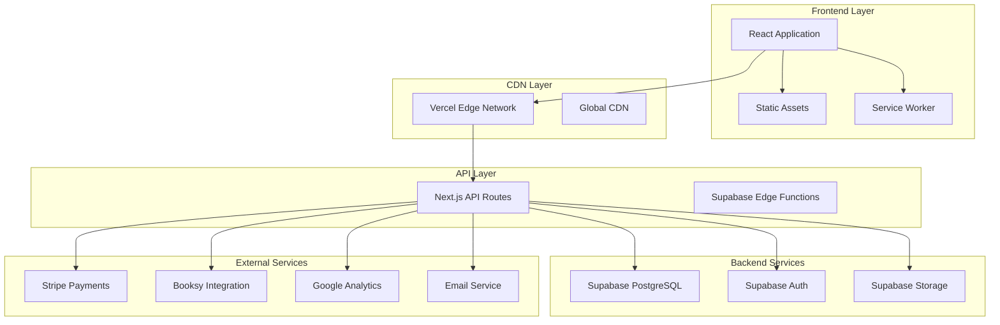

# Mariia Hub Platform - Deployment and Operations Documentation

**Version:** 1.0
**Last Updated:** 2025-10-30
**Owner:** DevOps Team
**Review Date:** Monthly

## Overview

This documentation suite provides comprehensive procedures and guidelines for deploying, operating, and maintaining the Mariia Hub platform. It covers all aspects of production deployment, emergency response, routine maintenance, and configuration management.

## Quick Access

### Emergency Situations
- **🚨 Immediate Emergency**: [Emergency Procedures](./03-emergency-procedures.md#emergency-response-framework)
- **🔧 Service Outage**: [Service Outage Handling](./02-operational-runbooks.md#service-availability-issues)
- **🔒 Security Incident**: [Security Breach Response](./03-emergency-procedures.md#security-breach-response)
- **⏪ Emergency Rollback**: [Emergency Rollback Procedures](./03-emergency-procedures.md#emergency-rollback-procedures)

### Common Operations
- **🚀 Standard Deployment**: [Deployment Playbook](./01-deployment-playbook.md#deployment-procedures)
- **🔍 Troubleshooting**: [Performance Troubleshooting](./02-operational-runbooks.md#performance-troubleshooting)
- **⚙️ Configuration Changes**: [Configuration Management](./05-configuration-management.md#configuration-change-process)
- **🛠️ Maintenance Tasks**: [Maintenance Procedures](./04-maintenance-procedures.md#maintenance-schedule)

### Planning and Reference
- **📋 Contact Information**: [Emergency Contacts](#emergency-contacts)
- **📚 Documentation Index**: [Document Index](#document-index)
- **🏗️ Architecture Overview**: [System Architecture](#system-architecture-overview)
- **📊 Monitoring Dashboards**: [Monitoring Setup](#monitoring-and-alerting-setup)

## Document Index

### Core Documentation

#### 1. [Deployment Playbook](./01-deployment-playbook.md)
Comprehensive procedures for deploying the Mariia Hub platform to all environments.

**Key Sections:**
- [Pre-Deployment Requirements](./01-deployment-playbook.md#pre-deployment-requirements)
- [Standard Production Deployment](./01-deployment-playbook.md#standard-production-deployment)
- [Hotfix Deployment](./01-deployment-playbook.md#hotfix-deployment)
- [Post-Deployment Verification](./01-deployment-playbook.md#post-deployment-verification)
- [Rollback Procedures](./01-deployment-playbook.md#rollback-procedures)

**When to Use:**
- Planning deployments to any environment
- Following standard deployment procedures
- Understanding deployment prerequisites
- Handling deployment failures

#### 2. [Operational Runbooks](./02-operational-runbooks.md)
Step-by-step procedures for common operational scenarios and incident response.

**Key Sections:**
- [Incident Response Procedures](./02-operational-runbooks.md#incident-response-procedures)
- [Performance Troubleshooting](./02-operational-runbooks.md#performance-troubleshooting)
- [Service Availability Issues](./02-operational-runbooks.md#service-availability-issues)
- [Database Issues](./02-operational-runbooks.md#database-issues)
- [Payment Processing Issues](./02-operational-runbooks.md#payment-processing-issues)

**When to Use:**
- Responding to operational incidents
- Troubleshooting performance issues
- Handling service degradations
- Managing third-party integration problems

#### 3. [Emergency Procedures](./03-emergency-procedures.md)
Critical procedures for emergency situations and disaster recovery.

**Key Sections:**
- [Emergency Response Framework](./03-emergency-procedures.md#emergency-response-framework)
- [Emergency Rollback Procedures](./03-emergency-procedures.md#emergency-rollback-procedures)
- [Disaster Recovery Execution](./03-emergency-procedures.md#disaster-recovery-execution)
- [Security Breach Response](./03-emergency-procedures.md#security-breach-response)
- [Critical Infrastructure Failure](./03-emergency-procedures.md#critical-infrastructure-failure)

**When to Use:**
- Critical incidents requiring immediate response
- System-wide failures
- Security breaches
- Disaster recovery scenarios

#### 4. [Maintenance Procedures](./04-maintenance-procedures.md)
Regular maintenance tasks and preventive procedures.

**Key Sections:**
- [Maintenance Schedule](./04-maintenance-procedures.md#maintenance-schedule)
- [Regular Maintenance Tasks](./04-maintenance-procedures.md#regular-maintenance-tasks)
- [Database Maintenance](./04-maintenance-procedures.md#database-maintenance)
- [Application Updates](./04-maintenance-procedures.md#application-updates)
- [Security Patching](./04-maintenance-procedures.md#security-patching)

**When to Use:**
- Planning regular maintenance activities
- Performing system updates
- Optimizing performance
- Managing security patches

#### 5. [Configuration Management](./05-configuration-management.md)
Procedures for managing all system configurations.

**Key Sections:**
- [Environment Variable Management](./05-configuration-management.md#environment-variable-management)
- [Feature Flag Management](./05-configuration-management.md#feature-flag-management)
- [DNS Configuration Management](./05-configuration-management.md#dns-configuration-management)
- [SSL Certificate Management](./05-configuration-management.md#ssl-certificate-management)
- [Configuration Security](./05-configuration-management.md#configuration-security)

**When to Use:**
- Managing environment configurations
- Updating feature flags
- Managing DNS and SSL settings
- Handling configuration changes

## System Architecture Overview

### Platform Components



### Environment Architecture

#### Production Environment
- **Frontend:** Vercel Edge Network
- **Backend:** Supabase (Frankfurt region)
- **Database:** PostgreSQL with RLS
- **Storage:** Supabase Storage
- **CDN:** Vercel Edge Network
- **Monitoring:** Custom dashboards + Vercel Analytics

#### Staging Environment
- **Frontend:** Vercel Preview Deployments
- **Backend:** Supabase Preview Branch
- **Database:** Preview database with sample data
- **Purpose:** Pre-production testing and validation

#### Development Environment
- **Frontend:** Local development server
- **Backend:** Supabase Local Instance
- **Database:** Local PostgreSQL
- **Purpose:** Development and testing

## Emergency Contacts

### Primary Emergency Contacts

| Role | Name | Phone | Email | Availability |
|------|------|-------|-------|--------------|
| Incident Commander | [Name] | [Phone] | [Email] | 24/7 |
| Technical Lead | [Name] | [Phone] | [Email] | 24/7 |
| Security Officer | [Name] | [Phone] | [Email] | 24/7 |
| DevOps Engineer | [Name] | [Phone] | [Email] | Business Hours |
| Communications Lead | [Name] | [Phone] | [Email] | Business Hours |

### Secondary Contacts

| Role | Name | Phone | Email | Availability |
|------|------|-------|-------|--------------|
| CTO | [Name] | [Phone] | [Email] | 24/7 |
| CEO | [Name] | [Phone] | [Email] | Business Hours |
| Legal Counsel | [Name] | [Phone] | [Email] | Business Hours |
| PR/Communications | [Name] | [Phone] | [Email] | Business Hours |

### Service Provider Contacts

| Service | Contact | Email | Phone | Support Hours |
|---------|---------|-------|-------|--------------|
| Vercel | Support | support@vercel.com | 24/7 Enterprise | 24/7 |
| Supabase | Support | support@supabase.io | 24/7 Enterprise | 24/7 |
| Stripe | Support | support@stripe.com | 24/7 Enterprise | 24/7 |
| Domain Registrar | [Name] | [Email] | [Phone] | Business Hours |

### Escalation Procedures

#### Level 1: Immediate Response (0-15 minutes)
1. Contact **Incident Commander**
2. Activate **Emergency Response Team**
3. Establish **communication channels**
4. Begin **initial assessment**

#### Level 2: Technical Escalation (15-60 minutes)
1. Contact **Technical Lead**
2. Engage **DevOps Engineer**
3. Involve **Security Officer** (if needed)
4. Coordinate with **service providers**

#### Level 3: Management Escalation (60+ minutes)
1. Notify **CTO**
2. Inform **CEO**
3. Engage **Legal Counsel** (if needed)
4. Coordinate **PR/Communications**

## Monitoring and Alerting Setup

### Primary Monitoring Tools

#### Application Monitoring
- **Vercel Analytics**: Real-time performance metrics
- **Custom Dashboards**: Business metrics and KPIs
- **Uptime Monitoring**: Service availability tracking
- **Error Tracking**: Application error monitoring

#### Infrastructure Monitoring
- **Supabase Dashboard**: Database performance and usage
- **Vercel Functions**: Edge function performance
- **CDN Analytics**: Content delivery performance
- **SSL Monitoring**: Certificate status and security

#### Business Monitoring
- **Stripe Dashboard**: Payment processing metrics
- **Google Analytics**: User behavior and traffic
- **Booking Metrics**: Conversion and usage analytics
- **Revenue Tracking**: Financial performance monitoring

### Alert Configuration

#### Critical Alerts (SEV-0)
- **Service Down**: Complete outage
- **Security Breach**: Data compromise detected
- **Payment Failure**: Payment processing down
- **Database Failure**: Database unavailable

#### High Priority Alerts (SEV-1)
- **High Error Rate**: >25% error rate for 5+ minutes
- **Performance Degradation**: Response time >5 seconds
- **SSL Certificate**: Expiring within 7 days
- **High Memory Usage**: Resource utilization >90%

#### Medium Priority Alerts (SEV-2)
- **Elevated Error Rate**: >10% error rate for 10+ minutes
- **Slow Performance**: Response time >2 seconds
- **Feature Flag Issues**: Unexpected flag behavior
- **Integration Issues**: Third-party service problems

### Dashboard Access

#### Production Dashboards
- **Main Dashboard**: [Link to primary monitoring dashboard]
- **Performance Dashboard**: [Link to performance metrics]
- **Security Dashboard**: [Link to security monitoring]
- **Business Dashboard**: [Link to business metrics]

#### Staging Dashboards
- **Staging Dashboard**: [Link to staging environment monitoring]
- **Testing Dashboard**: [Link to test results and metrics]

## Quick Reference Commands

### Essential Commands

#### Deployment Commands
```bash
# Standard deployment
npm run build
vercel --prod

# Emergency rollback
vercel rollback [deployment-url]

# Check deployment status
vercel list
vercel logs --since=1h
```

#### Database Commands
```bash
# Database status
supabase status --project-ref $VITE_SUPABASE_PROJECT_ID

# Apply migrations
supabase db push --project-ref $VITE_SUPABASE_PROJECT_ID

# Generate types
supabase gen types typescript --project-id $VITE_SUPABASE_PROJECT_ID
```

#### Testing Commands
```bash
# Run all tests
npm run test

# Run E2E tests
npm run test:e2e

# Run performance tests
npm run test:performance

# Run security tests
npm run test:security
```

#### Monitoring Commands
```bash
# Health check
npm run health-check:full

# Performance monitoring
npm run monitoring:realtime

# Security scan
npm run security:scan

# Configuration validation
npm run config:validate
```

## Common Scenarios and Solutions

### Scenario 1: Service Slow Performance
**Symptoms:** Slow page loads, high response times
**Immediate Actions:**
1. Check [Performance Troubleshooting](./02-operational-runbooks.md#performance-troubleshooting)
2. Run `npm run monitoring:performance-check`
3. Check Vercel Analytics for bottlenecks
4. Verify database query performance

### Scenario 2: Booking System Not Working
**Symptoms:** Users cannot complete bookings
**Immediate Actions:**
1. Check [Payment Processing Issues](./02-operational-runbooks.md#payment-processing-issues)
2. Test booking flow: `npm run test:booking-flow`
3. Verify Stripe connectivity
4. Check Supabase database connections

### Scenario 3: Security Incident Detected
**Symptoms:** Suspicious activity, unauthorized access
**Immediate Actions:**
1. Activate [Emergency Procedures](./03-emergency-procedures.md#security-breach-response)
2. Contact Security Officer immediately
3. Begin incident containment procedures
4. Preserve evidence for investigation

### Scenario 4: Database Connection Issues
**Symptoms:** Database timeouts, connection failures
**Immediate Actions:**
1. Check [Database Issues](./02-operational-runbooks.md#database-issues)
2. Verify Supabase status
3. Check connection limits
4. Test connectivity: `npm run test:db:connection`

### Scenario 5: SSL Certificate Problems
**Symptoms:** HTTPS warnings, certificate errors
**Immediate Actions:**
1. Check [SSL Certificate Management](./05-configuration-management.md#ssl-certificate-management)
2. Verify certificate status: `npm run ssl:check-status`
3. Check DNS configuration
4. Contact support if needed

## Documentation Maintenance

### Review Schedule
- **Monthly:** Review and update all procedures
- **Quarterly:** Major review and validation
- **Annually:** Comprehensive audit and updates
- **After Incidents:** Update relevant procedures

### Change Process
1. **Propose Changes:** Submit changes for review
2. **Technical Review:** DevOps team validates changes
3. **Approval:** Management approval for major changes
4. **Implementation:** Update documentation
5. **Communication:** Notify team of changes
6. **Training:** Train team on new procedures

### Version Control
- All documentation tracked in Git repository
- Version numbers for major updates
- Change logs for all modifications
- Backup copies maintained

## Training and Certification

### Required Training
- **Emergency Response:** All ERT members certified
- **Deployment Procedures:** All technical staff trained
- **Security Procedures:** Annual security training
- **Maintenance Procedures:** Quarterly refresher training

### Certification Requirements
- **DevOps Team:** Complete certification in all procedures
- **Development Team:** Deployment and maintenance procedures
- **Management Team:** Emergency response overview
- **Support Team:** Basic troubleshooting procedures

### Training Schedule
- **New Hires:** Complete within first 30 days
- **Annual Refresher:** All team members
- **Procedure Updates:** Within 7 days of changes
- **Emergency Drills:** Quarterly simulations

## Appendices

### A. Glossary of Terms

| Term | Definition |
|------|------------|
| **ERT** | Emergency Response Team |
| **SEV-0** | Severity Level 0 (Critical) |
| **Hotfix** | Emergency fix deployed outside normal schedule |
| **Rollback** | Reverting to previous stable version |
| **Blue-Green** | Deployment strategy with zero downtime |
| **Canary** | Gradual deployment to subset of users |
| **Feature Flag** | Toggle to enable/disable features |

### B. Acronyms and Abbreviations

| Acronym | Full Form |
|---------|-----------|
| **API** | Application Programming Interface |
| **CLI** | Command Line Interface |
| **CDN** | Content Delivery Network |
| **DNS** | Domain Name System |
| **SLA** | Service Level Agreement |
| **SLO** | Service Level Objective |
| **SLI** | Service Level Indicator |
| **RTO** | Recovery Time Objective |
| **RPO** | Recovery Point Objective |

### C. Related Documents

- [Security Audit Report](../security-audit-report.json)
- [System Architecture Documentation](../docs/architecture/)
- [API Documentation](../docs/api/)
- [User Documentation](../docs/user/)
- [Development Guidelines](../CLAUDE.md)

### D. External References

- [Vercel Documentation](https://vercel.com/docs)
- [Supabase Documentation](https://supabase.com/docs)
- [Stripe Documentation](https://stripe.com/docs)
- [React Documentation](https://react.dev)
- [TypeScript Documentation](https://www.typescriptlang.org/docs)

---

## Document Information

**Document Status:** Active
**Version:** 1.0
**Last Updated:** 2025-10-30
**Next Review Date:** 2025-11-30
**Approved By:** DevOps Team Lead
**Distribution:** All Technical Staff, Management Team

## Quick Navigation

- 🚀 [Start Deployment](./01-deployment-playbook.md)
- 🔧 [Troubleshoot Issue](./02-operational-runbooks.md)
- 🚨 [Emergency Response](./03-emergency-procedures.md)
- 🛠️ [Maintenance Tasks](./04-maintenance-procedures.md)
- ⚙️ [Configuration Changes](./05-configuration-management.md)

**For immediate assistance, contact the Incident Commander at [Phone Number].**