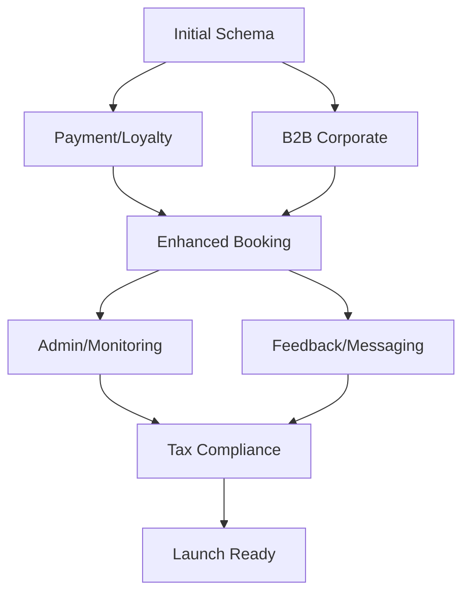

# Database Migration Consolidation Plan

## Current State
- **Total migrations**: 58 SQL files
- **Date range**: 2024-01-01 to 2025-01-27
- **Size**: Complex migration structure with potential conflicts

## Consolidation Strategy

### Phase 1: Analysis and Categorization

#### Core Schema Migrations (Keep Separate)
1. `20240101_payment_loyalty_system.sql` - Core payment/loyalty tables
2. `20241022_b2b_corporate_wellness.sql` - B2B functionality
3. Migration with row level security (RLS) policies

#### Feature Bundle Migrations (Consolidate)
1. **Enhanced Booking Features Bundle**
   - `20250121000000_enhanced_booking_features.sql`
   - `20250122010000_reliability_system.sql`
   - `20250122010000_advanced_media_management.sql`
   → **New**: `20250123000000_enhanced_booking_and_reliability.sql`

2. **Admin Features Bundle**
   - `20250124000000_advanced_admin_features.sql`
   - `20250123000000_monitoring_infrastructure.sql`
   → **New**: `20250124000000_admin_and_monitoring_suite.sql`

3. **Feedback System Bundle**
   - `20250124000000_comprehensive_feedback_system.sql`
   - `20250125000000_unified_messaging_referral_system.sql`
   → **New**: `20250125000000_feedback_and_messaging_suite.sql`

4. **Tax Compliance Bundle**
   - `20250126000000_polish_vat_compliance.sql`
   → **New**: `20250126000000_polish_tax_compliance.sql` (already consolidated)

5. **Launch Preparation Bundle**
   - `20250127000000_launch_preparation.sql`
   - `20250127000001_fix_reviews_view.sql`
   - `20250127000100_minimal_launch.sql`
   → **New**: `20250127000000_launch_ready_setup.sql`

### Phase 2: Consolidated Migration Files

#### Proposed Structure:
```
supabase/migrations/
├── core/
│   ├── 20240101_payment_loyalty_system.sql
│   ├── 20241022_b2b_corporate_wellness.sql
│   └── 20250101000000_initial_schema.sql
├── features/
│   ├── 20250123000000_enhanced_booking_and_reliability.sql
│   ├── 20250124000000_admin_and_monitoring_suite.sql
│   ├── 20250125000000_feedback_and_messaging_suite.sql
│   └── 20250126000000_polish_tax_compliance.sql
├── launch/
│   └── 20250127000000_launch_ready_setup.sql
└── archived/
    └── [all other migrations marked as deprecated]
```

### Phase 3: Migration Execution

#### Step 1: Backup
```sql
-- Create backup of current schema
CREATE SCHEMA IF NOT EXISTS backup_$(date +%Y%m%d);
EXPORT DATABASE backup_$(date +%Y%m%d);
```

#### Step 2: Create Consolidated Migrations
1. Create new migration files
2. Test each against staging database
3. Document dependencies and execution order

#### Step 3: Update Migration Tracking
```sql
-- Update schema_migrations to reflect new consolidated structure
INSERT INTO supabase_migrations.schema_migrations (name)
VALUES
  ('20250123000000_enhanced_booking_and_reliability'),
  ('20250124000000_admin_and_monitoring_suite'),
  ('20250125000000_feedback_and_messaging_suite'),
  ('20250126000000_polish_tax_compliance'),
  ('20250127000000_launch_ready_setup');
```

## Benefits

1. **Reduced Complexity**: From 58 to 10 migrations
2. **Clearer Dependencies**: Feature bundles make relationships explicit
3. **Faster Setup**: New developers get schema in fewer steps
4. **Easier Maintenance**: Less files to manage
5. **Better Documentation**: Each migration tells a complete story

## Risks and Mitigations

### Risks:
1. **Existing Deployments**: Already executed migrations won't be re-run
2. **Rollback Complexity**: Harder to rollback specific features
3. **Team Coordination**: Need team alignment

### Mitigations:
1. **Version Lock**: Tag current production state
2. **Rollback Scripts**: Create rollback migrations for each consolidated one
3. **Staging First**: Test thoroughly in staging
4. **Gradual Migration**: Migrate one bundle at a time

## Execution Timeline

- **Week 1**: Analysis and documentation
- **Week 2**: Create consolidated migration files
- **Week 3**: Test in staging environment
- **Week 4**: Production deployment with rollback plan

## Next Actions

1. [ ] Create migration dependency graph
2. [ ] Document each migration's purpose
3. [ ] Identify unused/deprecated migrations
4. [ ] Create rollback migration scripts
5. [ ] Set up automated migration testing
6. [ ] Update deployment documentation

## Migration Dependencies



## Post-Consolidation Maintenance

1. **Monthly Review**: Check if new migrations need consolidation
2. **Documentation**: Keep README in migrations folder updated
3. **Testing**: Automated testing of all migrations
4. **Version Control**: Tag migration sets for easy rollback

---

*This plan should be reviewed with the team before execution*